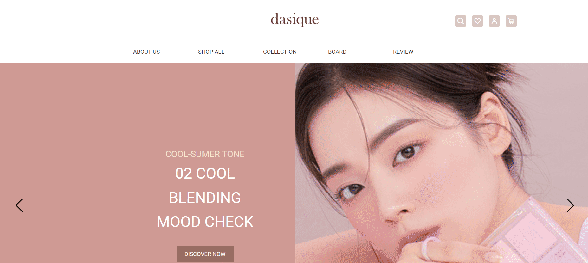

# Responsiv_Wep : Desique
- pc / tablet / mobile 반응형 웹 구현
- Menu 기능 구현 (JavaScripte)
- swiper 사용

---
## 1. 반응형 웹 구현 결과물 
### 1.1 pc - 해상도 1024 이상
- css : 단위 px 사용


---
### 1.2 tablet - 해상도 768px ~ 1024px
- css : 단위 vw 사용


---
### 1.3 mobile - 해상도 767px 이하
- css : 단위 vw 사용


## 2. Menu 기능 구현 (JavaScripte)
### 2.1 pc버전 menu


### 2.1 tablet, mobile 버전 menu


- all메뉴 버튼 클릭 시 아이콘 'x'로 변경, menu 보이기
    ```java
    allMenu.addEventListener('click',e=>{
        if(e.currentTarget.classList.contains('xi-bars')){
            allMenu.classList.replace('xi-bars','xi-close');
            gnb.style.display='block';
            bg.style.display='block';
        }else{
            allMenu.classList.replace('xi-close','xi-bars')
            gnb.style.display='none';
            bg.style.display='none';
        }
        gnbItem.forEach(ele=>{
            ele.classList.remove('on')
        })
    })
    bg.addEventListener('click',e=>{
        allMenu.classList.replace('xi-close','xi-bars')
        gnb.style.display='none';
        bg.style.display='none';
        gnbItem.forEach(ele=>{
            ele.classList.remove('on')
        })
    })
    ```


- menu 상세메뉴 보이기
    ```java
    gnbList.forEach(item=>{
        item.addEventListener('mouseenter',e=>{
            let current = e.currentTarget;
            gnbItem.forEach(ele=>{
                ele.classList.remove('on');
            })
            current.children[1].classList.add('on')
            
        })
    })
    header.addEventListener('mouseleave',e=>{
        gnbItem.forEach(ele=>{
            ele.classList.remove('on')
        })
    })
    ```

## 3. swiper 자동재생기능
